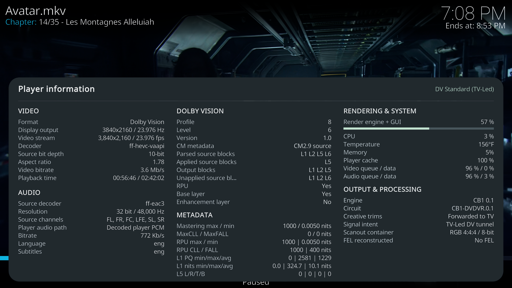
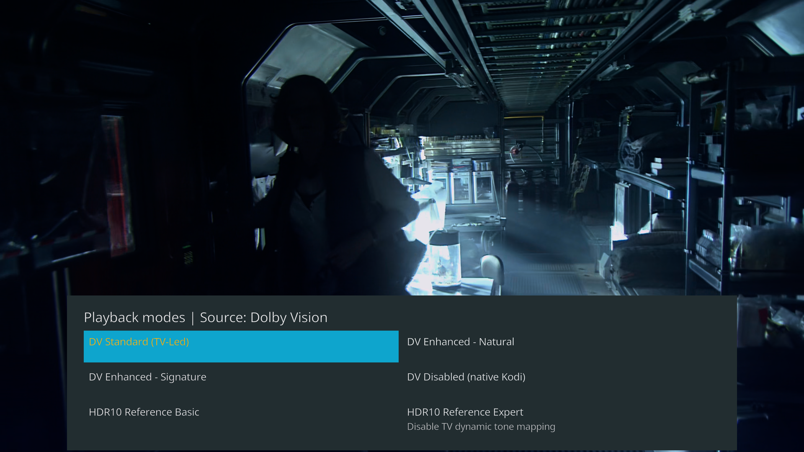

# LibreELEC with Dolby Vision support for Intel and AMD iGPU

**R1.0.0 Beta1**

LibreELEC Generic x86_64 community build with Dolby Vision playback and HDR10
conversion in Kodi's native VideoPlayer.

Powered by **CB1 0.1**, an open-source Dolby Vision processing engine. No external
player or proprietary Dolby SDK is required.

## Dolby Vision profiles

| Profile | Support |
| --- | --- |
| 5 | Yes |
| 7 MEL | Yes |
| 7 FEL | Yes, including enhancement-layer reconstruction |
| 8.1 | Yes |
| 8.2 | Yes |
| 8.4 | Yes |
| 10 | Yes |
| 9, legacy profiles, 20 | No |

CM2.9 and CM4 metadata are supported. Full supported FEL reconstruction occurs
before conversion. Creative-control application depends on the selected mode
and the metadata present in the source.

## Playback controls

Settings are in **Player > Videos**. The selector shows modes for the current
source; unsupported DV output is unavailable. Modes can change during playback.

With **Player information** enabled, press **O** to cycle:

1. Player information.
2. Quick rendering mode selection.
3. Video only.

Play/pause and seek remain available while either panel is open. Turning off
Player information restores Kodi's stock panel and disables the quick selector.
The optional startup mode notification is off by default.

### Player information

Video/audio source and output, DV profile and CM version, BL/EL/FEL state,
metadata blocks, active circuit, drops/skips and GPU render-engine usage.
HDR10 and SDR show their relevant fields without empty DV sections.

Screenshots are 1080p SDR previews of the HDR interface.

GPU usage measures Kodi's render engine, including visible GUI rendering,
not the whole GPU or video decoder. Source audio and PCM/passthrough output
are shown separately. Playback diagnostics are recorded in `kodi.log`.

## Rendering modes by source

| Source | Mode | Output | Result | TV profile |
| --- | --- | --- | --- | --- |
| Dolby Vision | DV Standard (TV-Led) | DV | Preserve the authored Dolby Vision presentation, with final mapping by the TV | Not required |
| Dolby Vision | DV Enhanced - Natural and Signature | DV | Adapt highlight and color response to the display profile, with two presets: Natural or Signature | Required |
| Dolby Vision | DV Disabled (native Kodi) | Native Kodi | Retain Kodi's original playback without custom DV processing | Not required |
| Dolby Vision | HDR10 Reference Basic | HDR10 | Play Dolby Vision content in HDR10 without a manual TV profile | Not required |
| Dolby Vision | HDR10 Reference Expert | HDR10 | Match HDR10 conversion to the display's peak and gamut, using available creative controls | Required |
| HDR10 | DV Reference (AI) | DV | Enable TV-Led Dolby Vision from HDR10 while preserving the source image | Not required |
| HDR10 | DV Enhanced (AI) - Natural and Signature | DV | Adapt HDR10 highlights and colors to the display profile for Dolby Vision output, with two presets: Natural or Signature | Required |
| HDR10 | HDR10 Native | HDR10 | Keep the original HDR10 presentation and Kodi playback | Not required |
| HLG / SDR | Native | HLG / SDR | Keep the original presentation and Kodi playback | Not required |

For more details, see [rendering modes and algorithms](docs/cb1/PROCESSING.md).

Standard Dolby Vision is the default. DV outputs are TV-Led. Expert and Enhanced
use the display peak and gamut entered in the TV profile. HDR10-to-Dolby Vision
AI modes use the CB1-L1L3 0.1 LightGBM model included in CB1 and staged by the build.

### Quick settings

Source format in the header, full mode names and DV outputs before HDR10 outputs.
All source-compatible modes fit in a two-column grid. TV profile configuration
stays in Player settings.

## Documentation

- [Processing and metadata](docs/cb1/PROCESSING.md): rendering logic and mode differences.
- [Output modes](docs/cb1/PLAYBACK.md): controls and display-profile settings.
- [Build](docs/cb1/BUILD.md), [versions](docs/cb1/VERSIONS.md) and [licensing](docs/cb1/LICENSING.md).

## Components

| Component | Changes |
| --- | --- |
| Linux display drivers | Native HDMI capability checks, DV signaling and protected scanout |
| Kodi | CB1 adapter, frame pairing, output selection, controls, information and diagnostics |
| CB1, included in this repository | Reconstruction, rendering policies, conversions and metadata |
| FFmpeg / libplacebo | Matched CB1 metadata and rendering patches |
| Mesa / media drivers / libva | Existing decoding and graphics stack, unmodified |

## Build and install

Release assets are an installation `.img.gz` and a native-update `.tar`.
Only one is needed. [Build instructions](docs/cb1/BUILD.md).

## Repository layout

| Path | Content |
| --- | --- |
| `projects/Generic/patches/linux/` | Display-driver changes |
| `projects/Generic/patches/kodi/` | Kodi integration |
| `packages/` | Native LibreELEC build recipes |
| `config/cb1-*.json` | Source locks, component versions and patch descriptions |
| `CB1/` | Processing engine, dependency patches and LightGBM model |
| `scripts/cb1-stage.py` | Stage the bundled CB1 sources |
| `docs/cb1/` | Playback, processing, build and licensing documentation |
| `tests/cb1/` | Source-staging and display-policy regression checks |
| `licenses/` | Upstream and additional retained notices |

## Hardware

| CPU generation / series with integrated graphics | Support |
| --- | --- |
| Intel Core 8th gen and newer | Dolby Vision output |
| Intel Core Ultra Series 1 / 2, including 200V | Dolby Vision output |
| Intel N-series, including N100 / N150 | Dolby Vision output |
| AMD Ryzen APUs: 2000G / 3000G, 4000 / 5000, 6000, 7030 / 7035, 7040 / 8040, 8000G, AI 300 | Experimental driver support |
| Other hardware | DV processing to HDR10 where GPU processing is available; no custom DV HDMI output |

Newly enabled Intel families require hardware testing.

Performance may vary by hardware. Report problems with the exact CPU/GPU,
display model, connection chain, build version and `kodi.log`.
[Hardware list](docs/cb1/HARDWARE.md).

## Known issues

- Some frame drops with Profile 7 FEL on a small number of files on N100/N150.

Report issues for this modified build here. Contact upstream projects only when
the issue also reproduces with their unmodified builds. No affiliation with or
certification by LibreELEC, Kodi, Dolby, Intel or AMD.

[Upstream LibreELEC README](docs/cb1/UPSTREAM.md)
